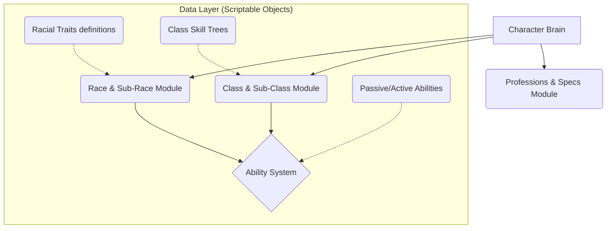

# ⚔️ RPG Entity Framework | Complex Character Architecture


🚧 **Development Notice:** *This framework is currently a Work in Progress (WIP). The core systems are actively being structured, and the API is subject to change as development evolves.*

**RPG Framework** is a specialized architectural solution for Unity designed exclusively to handle the deep complexity of role-playing character creation. Its core purpose is to provide a scalable, multi-layered system for building characters with intricate combinations of traits, decoupling the massive amount of data from the runtime logic.

## 🏗️ Planned Architecture

The framework is being built using a **Data-Driven** model. It focuses on solving the "composition problem" in RPGs, where a single character is the sum of heavily nested systems.



## 🚀 Installation
This framework is structured as a native UPM Package. To install it, open the Unity Package Manager, select "Install package from git URL," and paste the following link:
```link
git@github.com:Jisas/RPGEntityFramework.git?path=/Packages/com.jisas.rpgframework
```

## 🛠️ Key Features (In Development)
### 1. Multi-Layered Character Construction
The system is explicitly designed to handle heavily nested character definitions without hardcoding logic:
- **Ancestry:** Support for defining Races and Sub-Races, each granting specific baseline attributes, restrictions, and inherited traits.
- **Pathways:** Architecture for Classes and Sub-Classes, managing unlocking logic, progression, and specific behavioral sets.
- **Trades:** Support for Professions and Specializations, completely decoupled from combat classes to allow for complex social or crafting builds.

### 2. Deep Ability System
- **Passive & Active Traits:** A standardized way to define and inherit Racial abilities and Class abilities.
- **Event-Driven Modifiers:** The ability system hooks into the character's core systems dynamically. Passive skills apply persistent modifiers, while active skills are registered into the character's command queue without convoluting the Update() loop.

### 3. Native Integration (UPM & Tooling)
Like my other core systems, this framework prioritizes Developer Experience (DX):
- **Unity Package Manager (UPM):** Structured natively as a package (com.jisas.rpgframework) for easy version control and distribution across multiple projects.
- **Authoring Tools (UI Toolkit):** Custom dashboards and inspector tools in development to allow Game Designers to build these complex, multi-layered entities entirely via the Unity UI, ensuring data integrity.

## 📂 Package Structure
- /Runtime: Core runtime logic (Character Builder, Ability Handlers, Trait Managers).
- /Editor: Custom Unity editor scripts and management windows.
- /Samples: Integrated functional examples (e.g., Character Creator Demo).
- /Documentation~: API references and setup guides (WIP).

## 👨‍💻 Author
<div aling="left">  
  <h4>Jesús Carrero - Unity Gameplay Engineer</h1>
  <a href="https://jesuscarrero.netlify.app/">
    
  </a>
</div>
